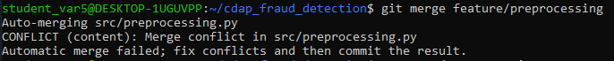
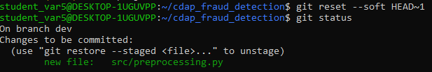
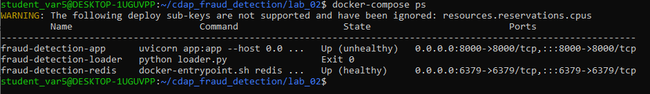
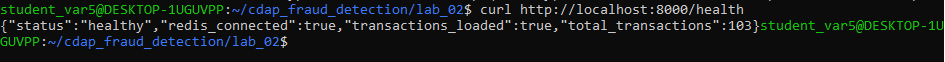
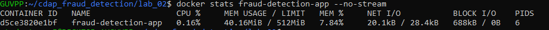
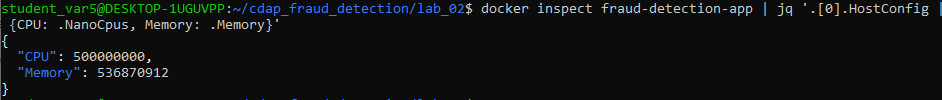
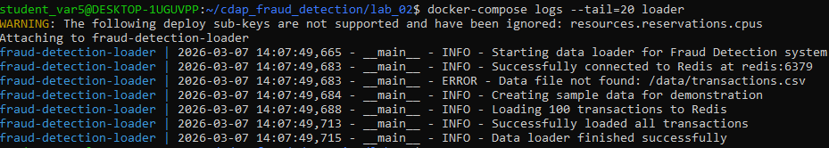

# Корпоративная платформа аналитики данных (CDAP)

## Лабораторная работа №1 — Система контроля версий Git

**Студент:** Бурлов Василий Тимофеевич  
**Группа:** БД-251м
**Вариант:** 5  

---

## Бизнес-задача

**Анализ мошеннических транзакций (Fraud):**  
Цель проекта — предобработка и анализ финансовых транзакций для выявления мошеннических операций.

---

## Проектная задача

Для выполнения варианта 5 создан скрипт:

- `src/preprocessing.py` — скрипт предобработки данных (удаление дублей).  

Проектная структура:

cdap_fraud_detection/

├── data/ # Сырые данные

├── notebooks/ # Jupyter ноутбуки

├── src/ # Исходный код (ETL-скрипты)

│ └── preprocessing.py

├── docs/

├── .gitignore # Игнорируемые файлы

└── README.md # Этот файл

---

## Техническое задание (Git Nuance)

- Последний коммит был отменён и переделан через `git reset --soft`.
- Ветка `dev` создана от `main`.
- Ветка `feature/preprocessing` создана для разработки скрипта предобработки.
- Выполнено слияние веток с разрешением конфликта.
- История коммитов отражает ветвление и merge.

---
## Скриншоты

## Конфликт в файле

## Отмена коммита (задание по варианту)

## Используемые технологии

- Git (система контроля версий)
- Python 3.x
- WSL2 / Ubuntu 22.04
- SSH для подключения к GitHub

---

## Ссылки

- **Репозиторий на GitHub:** [https://github.com/burlovvasya/cdap_fraud_detection](https://github.com/burlovvasya/cdap_fraud_detection)  

## Лабораторная работа №2 — Docker-контейнеризация

### Архитектура решения
В соответствии с вариантом №5 реализована микросервисная архитектура:

| Сервис | Роль | Технологии |
|--------|------|------------|
| **redis** | База данных (кэш транзакций) | Redis 7.2-alpine |
| **loader** | Init-контейнер для загрузки данных | Python, pandas, Redis |
| **app** | Fraud Detection API | FastAPI, Redis |

### Техническое задание варианта №5
- ✅ **Лимиты ресурсов:** CPU 0.5, RAM 512MB для контейнера `app`
- ✅ Healthcheck для всех сервисов
- ✅ Order of startup: Redis → Loader → App (с `depends_on` и `condition: service_healthy`)
- ✅ Данные сохраняются в named volume `fraud-detection-redis-data`

### Структура проекта (ЛР2)

cdap_fraud_detection/
├── lab_02/ # Docker-конфигурация

│ ├── docker-compose.yml # Оркестрация сервисов

│ ├── .env.example # Шаблон переменных окружения

│ ├── .dockerignore # Исключения для Docker

│ ├── loader/ # ETL-сервис загрузки данных

│ │ ├── Dockerfile

│ │ ├── requirements.txt

│ │ └── loader.py

│ └── app/ # Fraud Detection API

│ ├── Dockerfile

│ ├── requirements.txt

│ └── app.py

└── ... (остальные папки из ЛР1)

---

### Инструкция по запуску

#### Перейти в папку с Docker-конфигурацией:
cd ~/cdap_fraud_detection/lab_02

#### Настроить окружение:
cp .env.example .env

#### Запустить сервисы:
docker-compose up -d

#### Проверить статус:
docker-compose ps

---

#### 1. Статус контейнеров

*Все сервисы запущены: redis (healthy), loader (exit 0), app (up)*

#### 2. Health check API

*API отвечает: status healthy, данные загружены (103 транзакции)*

#### 3. Лимиты ресурсов (docker stats)

*Видны лимиты памяти: 512MB limit, реальное использование 40.16MB*

#### 4. Подтверждение лимитов (docker inspect)

*CPU: 0.5 (500000000), Memory: 512MB (536870912)*

#### 5. Логи успешной загрузки данных

*Loader создал тестовые данные и загрузил 100 транзакций в Redis

---

### Выводы по лабораторной работе №2
- ✅ Реализована микросервисная архитектура из трёх сервисов
- ✅ Настроены healthcheck и зависимости между сервисами
- ✅ Выполнено техническое задание варианта №5 (лимиты ресурсов CPU 0.5, RAM 512MB)
- ✅ Данные успешно загружаются в Redis и доступны через API
- ✅ Dockerfile написаны с соблюдением best practices (multistage build, непривилегированный пользователь, очистка кэша)

### Используемые технологии
- **Git** — система контроля версий
- **Python 3.10** — язык программирования
- **FastAPI** — фреймворк для создания API
- **pandas** — обработка данных
- **redis-py** — клиент для Redis
- **Docker / Docker Compose** — контейнеризация и оркестрация
- **WSL2 / Ubuntu 24.04** — среда разработки
- **Redis 7.2** — база данных в памяти

### Ссылки
- **Репозиторий на GitHub:** [https://github.com/burlovvasya/cdap_fraud_detection](https://github.com/burlovvasya/cdap_fraud_detection)
