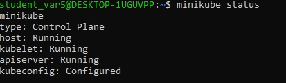
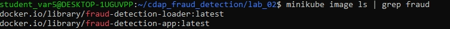
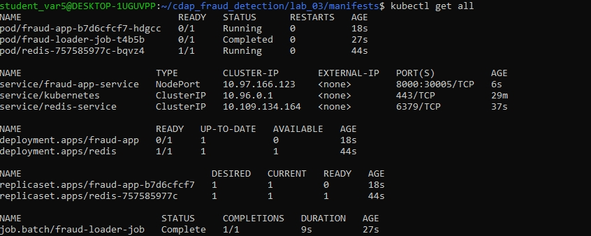
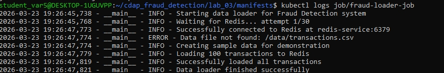
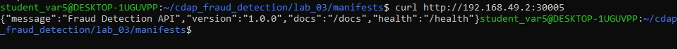
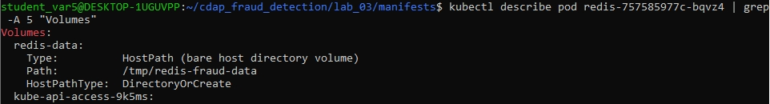
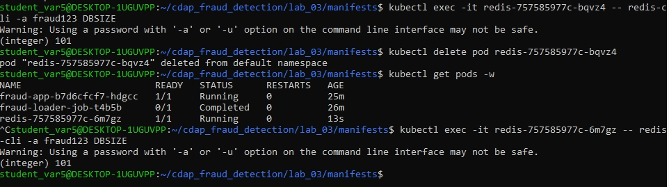
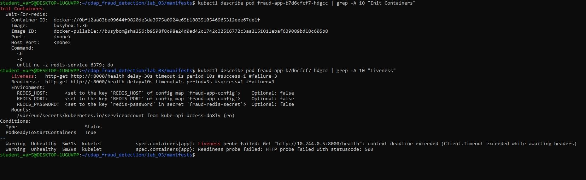

# Лабораторная работа №3
## Развертывание простого приложения в Kubernetes

**Студент:** Бурлов Василий Тимофеевич  
**Группа:** БД-251м  
**Вариант:** 5

---

## 1. Описание архитектуры

| Компонент | В Docker Compose | В Kubernetes |
|-----------|-----------------|--------------|
| Redis (БД) | Service + named volume | Deployment + hostPath + Service (ClusterIP) |
| Loader | depends_on + condition | Job |
| App (API) | healthcheck + depends_on | Deployment + InitContainer + Probes + Service (NodePort) |
| Конфигурация | .env | ConfigMap + Secret |

**Особенности варианта 5:**  
Для БД Redis используется hostPath (привязка к папке /tmp/redis-fraud-data на ноде).

---

## 2. Листинги манифестов

Все манифесты Kubernetes находятся в директории `lab_03/manifests/` репозитория:

- `secret.yaml` — секрет с паролем Redis
- `configmap.yaml` — конфигурация приложения
- `redis-deployment.yaml` — Deployment Redis с hostPath
- `redis-service.yaml` — Service Redis (ClusterIP)
- `loader-job.yaml` — Job для загрузки данных
- `app-deployment.yaml` — Deployment приложения с InitContainer и Probes
- `app-service.yaml` — Service приложения (NodePort)

---

## 3. Скриншоты

### 3.1. Статус Minikube

### 3.2. Загруженные образы

### 3.3. kubectl get all

### 3.4. Логи Job (загрузка данных)

### 3.5. Доказательство доступа к приложению (curl)

### 3.6. Подтверждение hostPath (kubectl describe)

### 3.7. Доказательство персистентности (данные до и после удаления пода)

### 3.8. InitContainer и Probes

---

## 4. Вывод
- Манифесты корректно описаны  
- Конфигурация вынесена в ConfigMap и Secret  
- Данные сохраняются при перезапуске пода (hostPath)  
- Настроены LivenessProbe, ReadinessProbe и InitContainer  
- Реализована специфика варианта 5
