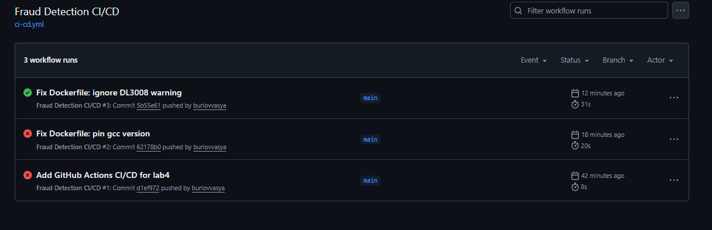
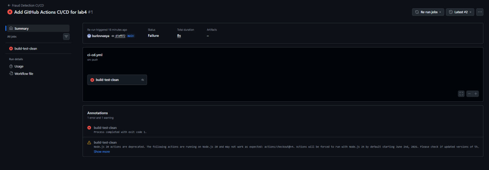
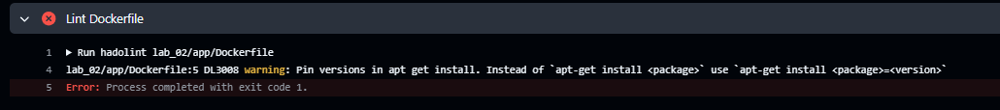
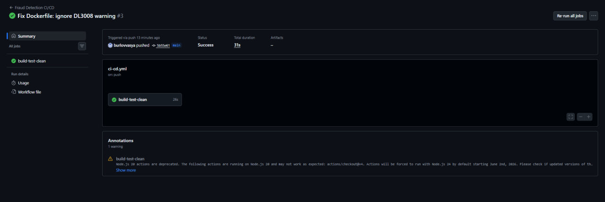
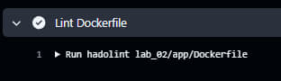

# Лабораторная работа №4
## Автоматизация ETL-скрипта с помощью CI/CD

**Студент:** Бурлов Василий Тимофеевич  
**Группа:** БД-251м  
**Вариант:** 5  
**Инструмент:** GitHub Actions

---

## 1. Описание CI/CD пайплайна

**Pipeline стадии:**
1. Checkout — получение кода из Git
2. Install hadolint — установка линтера для Dockerfile
3. Lint Dockerfile — проверка Dockerfile (Quality Gate)
4. Build Image — сборка Docker-образа приложения
5. Smoke test — проверка, что образ работает
6. Clean up — очистка ресурсов

**Quality Gate (вариант 5):**  
Проверка Dockerfile через hadolint. При наличии ошибок пайплайн падает.

---

## 2. Workflow файл

Файл находится в `.github/workflows/ci-cd.yml` репозитория.

```yaml
name: Fraud Detection CI/CD

on:
  push:
    branches: [ main, master ]
  pull_request:
    branches: [ main, master ]

jobs:
  build-test-clean:
    runs-on: ubuntu-latest
    
    steps:
      - name: Checkout code
        uses: actions/checkout@v4
      
      - name: Install hadolint
        run: |
          sudo wget -O /usr/local/bin/hadolint https://github.com/hadolint/hadolint/releases/download/v2.12.0/hadolint-Linux-x86_64
          sudo chmod +x /usr/local/bin/hadolint
      
      - name: Lint Dockerfile
        run: |
          hadolint lab_02/app/Dockerfile
      
      - name: Build Docker image
        run: |
          docker build -t fraud-detection-app:${GITHUB_RUN_ID} -f lab_02/app/Dockerfile lab_02/app/
      
      - name: Smoke test (check image)
        run: |
          docker run --rm fraud-detection-app:${GITHUB_RUN_ID} python -c "import app; print('OK')" || true
      
      - name: Clean up
        if: always()
        run: |
          docker image prune -f
          docker system prune -f
          echo "Cleanup completed"
```
## 3. Скриншоты

### 3.1. Общий вид Actions (красный и зеленый запуски)


### 3.2. Провальный запуск (красный статус)


### 3.3. Лог с ошибкой hadolint


### 3.4. Успешный запуск (зеленый статус)


### 3.5. Стадия Lint Dockerfile (успешно)


## 4. Вывод

- GitHub Actions настроен, workflow создан  
- Workflow содержит 6 стадий  
- Реализован Quality Gate: hadolint. Продемонстрированы провальный и успешный запуски  
- Docker-образ успешно собирается в пайплайне
